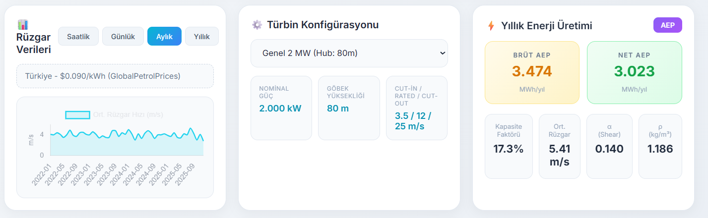
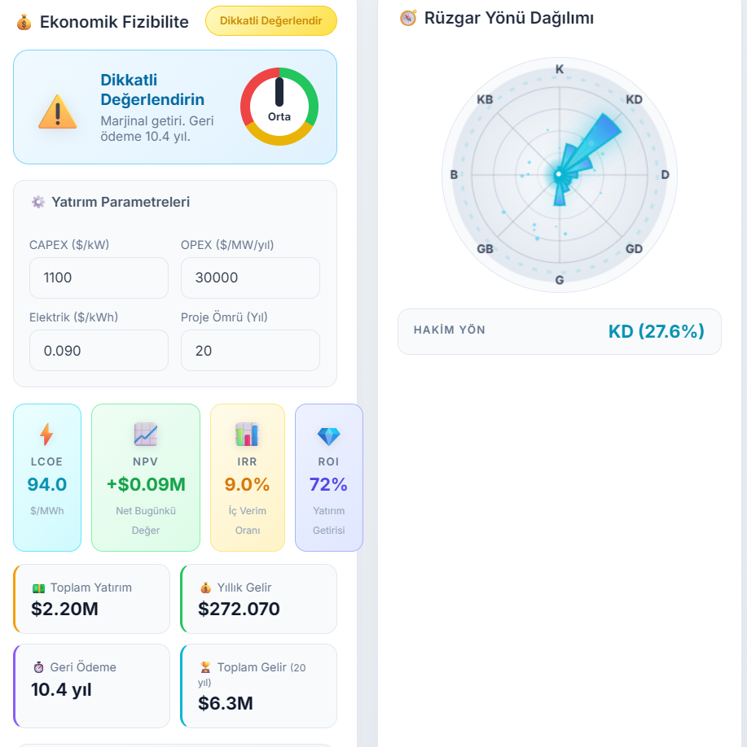
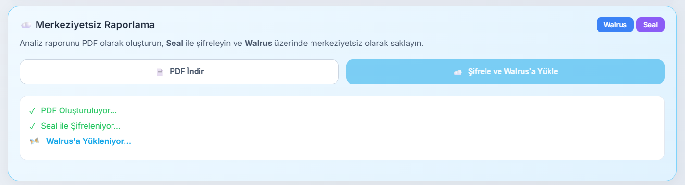

# WEIAP - Rüzgar Enerjisi Yatırım Analiz Platformu

Yapay zeka destekli analiz ve merkeziyetsiz depolama ile rüzgar enerjisi yatırımlarını değerlendiren bir hackathon projesi.

---

## Özellikler

- **Konum Tabanlı Analiz** – Leaflet haritası üzerinden istediğiniz konumu seçin. Open-Meteo ERA5 arşivinden saatlik rüzgar hızı, yönü, sıcaklık ve basınç verileri otomatik olarak çekilir.
- **Türbin Konfigürasyonu** – Vestas V110-2.0, V150-4.2 gibi gerçek türbin modelleri arasından seçim yapın. Hub yüksekliği, cut-in/cut-out hızları ve nominal güç değerleri otomatik hesaplanır.
- **Dinamik Elektrik Fiyatları** – EPİAŞ (Türkiye PTF), EIA (ABD), ENTSO-E (Avrupa) ve Eurostat API'lerinden anlık fiyatlar çekilir. API erişilemezse GlobalPetrolPrices verileri kullanılır.
- **Finansal Metrikler** – LCOE (Enerji Maliyeti), NPV (Net Bugünkü Değer), IRR (İç Verim Oranı), ROI ve geri ödeme süresi hesaplanır. Otomatik yatırım önerisi sunulur.
- **Yapay Zeka Analizi** – OpenAI GPT-4o ile verileriniz analiz edilir ve profesyonel yatırım değerlendirmesi oluşturulur.
- **Merkeziyetsiz Depolama** – Raporlar PDF olarak oluşturulur, Seal protokolü ile şifrelenir ve Sui blockchain üzerinde Walrus ağına yüklenir. Blob ID ile kalıcı erişim sağlanır.

---

## Ekran Görüntüleri

### Dünya Haritası ile Konum Seçimi
Open-Meteo ERA5 arşiv verileriyle entegre çalışan Leaflet haritası. Harita üzerinde herhangi bir noktaya marker bırakarak o konumun rüzgar hızı, yönü, sıcaklık ve basınç verilerini çekebilirsiniz.

### Türbin Seçimi ve Enerji Üretim Tahmini
Vestas V110, V150 gibi gerçek türbin modelleri arasından seçim yapın. EPİAŞ, EIA ve ENTSO-E API'lerinden çekilen dinamik elektrik fiyatlarıyla yıllık enerji üretimi (AEP) ve kapasite faktörü hesaplanır.

### Ekonomik Fizibilite Raporu
NPV (Net Bugünkü Değer), IRR (İç Verim Oranı), ROI ve geri ödeme süresini içeren kapsamlı finansal analiz. Yatırım kararı için "Yatırım Önerilir", "Dikkatli Değerlendir" veya "Önerilmez" şeklinde otomatik öneri sunar.

### Merkeziyetsiz Raporlama (Walrus & Seal)
Analiz raporunu PDF olarak oluşturun, Seal protokolü ile şifreleyin ve Walrus ağına yükleyin. Blob ID ile raporunuza her zaman erişebilirsiniz.

---

## Teknoloji Yığını

| Kategori | Teknolojiler |
|----------|--------------|
| Frontend | HTML, CSS, JavaScript, Vite |
| Harita | Leaflet, Leaflet-Geoman |
| Blockchain | Sui, Walrus, Seal |
| Yapay Zeka | OpenAI GPT-4o |
| API'ler | Open-Meteo ERA5, EPİAŞ, EIA, ENTSO-E, Eurostat |

---

## Takım

Hackathon kapsamında geliştirilmiştir:

- [Kevser Aslan](https://github.com/kevseraslan)
- [Ömer Çanakçı](https://github.com/omercnkc)
- [Bilal Abiç](https://github.com/BilalAbic)

---

## Kaynaklar ve Teşekkürler

- **Hesaplamalar**: Teknik formüller [HesaplamalarV1.pdf](references/HesaplamalarV1.pdf) dosyasından referans alınmıştır.
- **Elektrik Fiyatları**: Fiyat verileri için [GlobalPetrolPrices](https://tr.globalpetrolprices.com/Malaysia/electricity_prices) kaynağına teşekkürler.
- **Hava Durumu Verileri**: Ücretsiz API desteği için [Open-Meteo](https://open-meteo.com/en/docs) ekibine teşekkürler.
- **Araştırma**: Araştırma süreçlerindeki katkıları için Gemini'ye teşekkürler.

> Bu README yapay zeka yardımıyla oluşturulmuştur.
